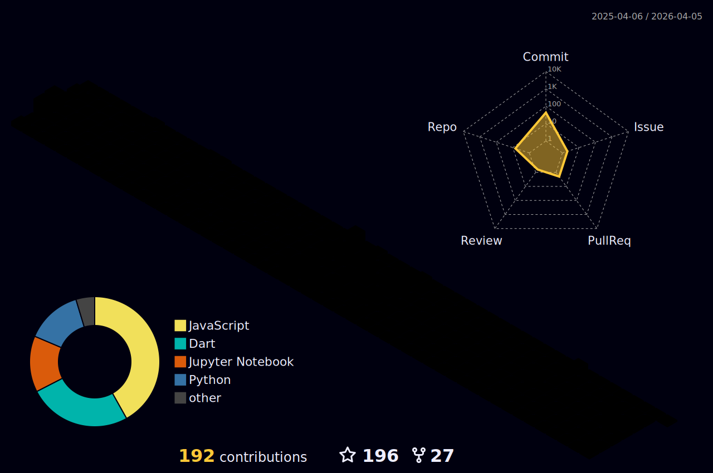

<!-- Header Section -->
<h1 align="center">
  
  Hey there, I'm GMP Sankalpa! 
  
</h1>

<!-- Animated Gif Section -->

  

<!-- Typing Animation Section -->

  

  

<!-- Subheader Section -->
<h3 align="center">Welcome to my GitHub profile! Here you can find some cool projects I have helped my developers create.</h3>

---
<!-- Personal Info Section -->
<h4 align="center">
     Undergraduate |  Galewela, Sri Lanka |  Studying at South Eastern University of Sri Lanka
</h4>

---

<!--  -->

---
<!-- Technologies Section -->
<h2 align="center"> Technologies & Languages</h2>

  I love exploring diverse programming realms and have hands-on experience with cutting-edge technologies:

  
  
  
  
  
  
  
  
  
  

---
<!-- Skills Section -->
<h2 align="center"> Skills & Specialties</h2>

  As an AI enthusiast, I specialize in cutting-edge technologies, such as:

  
  
  
  

---
<!-- Collaboration Section -->
<h2 align="center">  Let's Collaborate!</h2>

  🌟 I'm on a continuous journey of learning and honing my skills. If you have exciting project suggestions or collaboration ideas, feel free to drop them in my inbox! 🚀✨

<h2> GitHub Stats:</h2>

</picture>

🔹Profile 3D Contributions🔹

  

  

  

<!--  -->
<!--  -->

---

  
***My Contributions***   

<h2> GitHub Trophies:</h2>

  
<h2> Random Dev Quote:</h2>

 

<h2> Top Contributed Repo:</h2>

 

  

<h2> Socials:</h2>

 
Feel free to reach out to me on different platforms. 
        

<!-- 🌐 Website Section -->
<h2> Website:</h2>

  Explore more about me on my personal website. 🚀 
  

<h2> Tech Stack:</h2>

 
                                      

<!-- 📜 Other Section -->
<h2> Discord:</h2>

  Connect with me on Discord and see what I'm up to! 🎮 
  

<!-- 🎶 Vibing to Section -->
<h2> Vibing to:</h2>

  Currently enjoying some tunes on Spotify. 🎧 
  

<!-- 💰 Donation Section -->
<h2>  You can help me by Donating:</h2>

  Support my work by buying me a coffee! ☕ 
  

<!-- Greeting Section -->
<h4 align="center">
  𝚃𝚑𝚊𝚗𝚔 𝚈𝚘𝚞 𝙵𝚘𝚛 𝚈𝚘𝚞𝚛 𝙲𝚘𝚖𝚒𝚗𝚐 𝙼𝚢 𝙶𝚒𝚝𝙷𝚞𝚋 𝙿𝚛𝚘𝚏𝚒𝚕𝚎 🤝 
  𝙷𝚊𝚟𝚎 𝚊 𝚠𝚘𝚗𝚍𝚎𝚛𝚏𝚞𝚕 𝚘𝚛 𝚐𝚛𝚎𝚊𝚝 𝚍𝚊𝚢 ! 
   
</h4>

---

   
   
   
   

  

 
